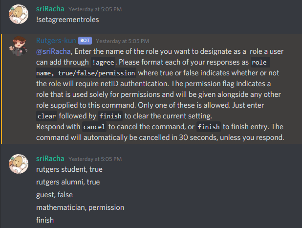
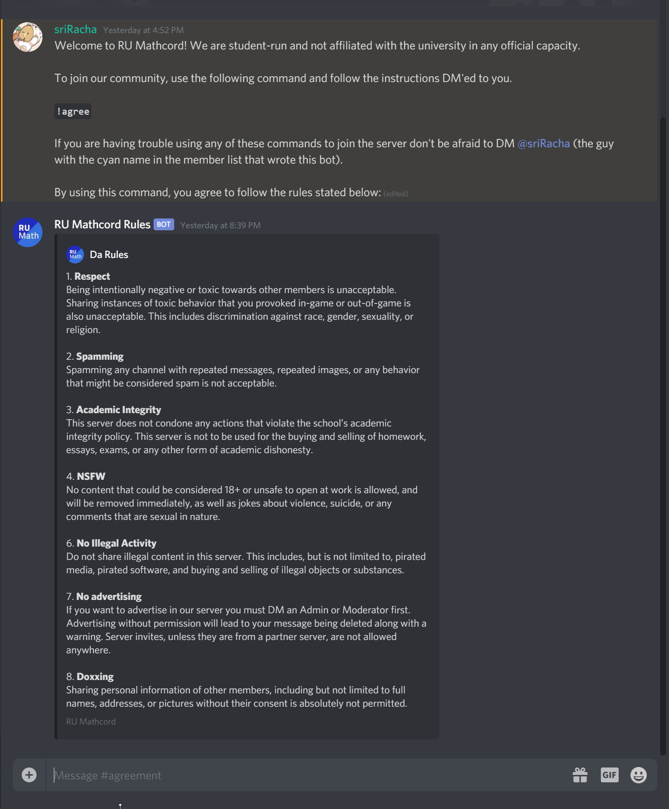

# Rutgers-kun 3.0 Documentation

## Hiya!
If you just added me to a server you're probably wondering how to set me up to verify Rutgers emails just like Rutgers Esports! Since v3.0 of this bot, I've been able to do that on any server with some setup. I'll show you how to set that up (and more, if you're interested) in this document. If you want to just skip the fluff and get to the good parts, the important text will be in **bold**. This guide will assume your prefix is `!`, but if you set the prefix to something else you will have to use that prefix.

# Setting up your Rutgers email verification system:
The basic process of setting this up will require that you:
* Have a **role for the bot to give a user when they have successfully authenticated their email**.
* Have a **channel for the bot to use as a "splash page" where they `!agree` to the server rules**.
* Have a **channel for the bot to send "welcome" messages to**.

It is also recommended you:
* Turn off built-in welcome messages from Discord since they show when a user joins; not when they `!agree` to the rules. This can be misleading.

## Setting up your agreement roles:
In the process of doing this you will use the command: 

### `!setagreementroles`

With this command you can set up an **array of roles that a user can pick from** when they `!agree` to the server rules.

After running the command it will prompt you to enter a series of strings comprised of:
* **a role** (whose name can just be entered, this is not case-sensitive)
* **a comma** (to separate the role and the following value)
* **true or false or permission**
    * **true** indicates that the preceding role would **require netID verification**
    * **false** indicates that the preceding role would **not require netID verification** (the user will skip all the steps and instantly enter the server with this role)
    * **permission** indicates an **unpickable role** that will be **given to the user alongside one of the roles they pick**

**Note:** Ensure every string is its own message and that when you're done entering inputs, enter `finish` as its own message.

Example: 

In this example, I set both the Rutgers Student role and Rutgers Alumni roles to requiring verification, the Guest role to not require verification, and I have a Mathematician role used for permissions that every user that has `!agree`d should have.

### `!setwelcomechannel`

With this command you can choose which channel **users will be greeted** in when they agree.

The command will prompt you to enter a channel. You can enter simply the channel's name or you can link the channel with #, it doesn't matter.

### `!setagreementchannel`

With this command you can choose which channel **users will see when they first enter the server**.

Just like the last command, it will prompt you to enter a channel.

Before you run this command **make sure the channel you intend to use it with is:**
* **Only visible to users who first join and haven't agreed to the server rules yet**.
* **Gives regular users the ability to type in the channel**. (This is so they can actually type `!agree`)
* **There is a clear prompt to enter `!agree` in the channel**.
* **Server rules or whatever else you want the user to read and agree to are clearly listed**.

Example:

### `!setwelcometext` **(OPTIONAL)**
Want to have some custom welcome text for when a user joins your server? 

Run **`!setwelcometext` and write any string you want** and the bot will send that message in the channel designated with `!setwelcomechannel`.

Writing `[user]` and `[guild]` in your string will replace those parts of the text with the name of the user who joined and the name of the server, respectively.

### P.S.:
You can use `!setautoverify` to set a phrase that users can enter in the agreement channel to skip verification and instantly get their role. This is useful for events such as the involvement fair where user retention is critical to the success of your club or Discord server.

# Setting up your Rutgers email verification system (slim):
Use an emote reaction to grant a single role gated by netID verification.

### Send a message to some channel
To use this, you should send a message that you intend for people to react to to get their role:

### `!agreementsetupslim`
Just run the command in the **same channel** that you sent the message in the above step. Then enter:
1. The **name of the role** you want people to receive when they click the emoji and verify their netID.
2. Right click the message you sent before and click "Copy ID". If this menu option doesn't appear you may need to enable it (Discord settings --> Appearance --> Developer Mode.)

## That's it! If you just wanted to know how to set up your email verification system you're done! If you want to configure your server more continue reading.

# Checking your selected configurations:

If you ever decide you want to look at the configs you set for the bot just **enter `!configs` in any channel** in your server.

# Setting up approval system for custom commands, custom soundboard files, custom emotes

Rutgers-kun has support for:
* adding custom commands, 
* custom soundboard files, 
* and custom emotes baked right into the bot!

However, most server owners are likely not keen on allowing anyone to add whatever they want to the server.

If you'd like to have your moderator team screen these requests **run `!setapprovalchannel` on some channel only you and your moderator team can see**.

Next time someone without the kick members permission tries to perform any of the three actions an embed with the action information will be sent to that channel and you will be able to react with a thumbs up or thumbs down to approve or reject the request. Upon approval or rejection the user will be notified via DM.

# Logging

## Regular logging
Rutgers-kun can log:
* User joins
* User leaves
* Message edits
* Message deletes

To log these **run `!setlogchannel`** on a channel.

# Role Responses
Have you ever wished you had a system that would automatically DM users something when they add a role?

You can do this with **`!setroleresponse`! Run the command and follow the instructions.**

# Find the word counter messages annoying? Turn them off:
Rutgers-kun has a feature that allows users to track certain words and output a new count of that word every time a user uses that word.

This functionality is available across all servers Rutgers-kun is in, so their word trackers may be carried over from other servers. If you want to mute these messages server-wide **just run: `!togglewordcounters`**.
